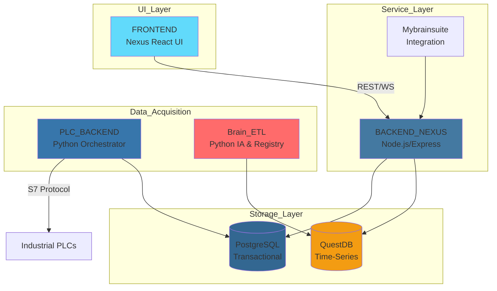
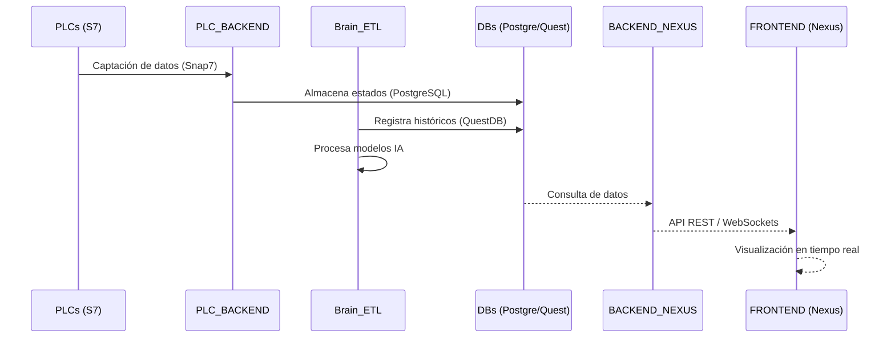
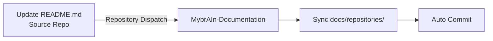

# MybrAIn-Documentation

Documentación centralizada del ecosistema MybrAIn - Sistema SCADA industrial de Clauger.

## 📋 Índice

- [Descripción General](#descripción-general)
- [Arquitectura del Sistema](#arquitectura-del-sistema)
- [Repositorios del Ecosistema](#repositorios-del-ecosistema)
- [Guía de Despliegue en Planta](#guía-de-despliegue-en-planta)
- [Flujo de Datos](#flujo-de-datos)
- [Sincronización Automática](#sincronización-automática)

## 🎯 Descripción General

MybrAIn es un ecosistema avanzado de monitorización, control y eficiencia energética industrial desarrollado por Clauger. Integra adquisición de datos en tiempo real de PLCs, almacenamiento de alta velocidad, interfaces de supervisión reactivas y modelos de inteligencia artificial.

### Componentes Principales

- **PLC_BACKEND**: Sistema de Orquestación Multi-PLC (acquisition engine).
- **FRONTEND (Interfaz Nexus)**: Interfaz de Supervisión SCADA y gestión energética.
- **Brain_ETL (IA_FREEZING_SPEED_PREDICTION)**: Proceso de registro y lógica de IA.
- **BACKEND_NEXUS (MYSQL_QUERIES_INTERFACE)**: Capa de servicios para la interfaz Nexus.
- **Mybrainsuite**: Integración y utilidades del ecosistema.

## 🏗️ Arquitectura del Sistema

## 📁 Repositorios del Ecosistema

### 🚀 [PLC_BACKEND](./docs/repositories/PLC_BACKEND.md)
**Sistema de Orquestación Multi-PLC**
- Motor de adquisición v4.5.1.
- Hilos independientes para lectura paralela de PLCs Siemens S7 (Snap7).
- Persistencia transaccional en **PostgreSQL**.
- Stack: Python 3.10+, psycopg2, python-snap7.

### 📊 [FRONTEND](./docs/repositories/FRONTEND.md)
**Interfaz Nexus - Supervisión SCADA**
- Interfaz reactiva de alto rendimiento (React 18 + Vite).
- Dashboards de monitorización industrial y gestión energética.
- Sistema de Licenciamiento por Hardware ID.
- PWA instalable para dispositivos de planta.

### 🧠 [Brain_ETL](./docs/repositories/Brain_ETL.md)
**Proceso de Registro e IA**
- Registro de datos históricos de alta velocidad.
- Modelos de predicción para velocidad de congelación y optimización.
- Integración directa con **QuestDB**.

### 🔌 [BACKEND_NEXUS](./docs/repositories/BACKEND_NEXUS.md)
**Interfaz de Servicios de Datos**
- API principal para el Frontend Nexus.
- Conecta la interfaz de usuario con los datos de **PostgreSQL** y **QuestDB**.
- Gestiona la lógica de negocio y autenticación.

### 📦 [Mybrainsuite](./docs/repositories/Mybrainsuite.md)
**Suite de Integración**
- Herramientas y utilidades compartidas del ecosistema.
- Capa de integración entre los diferentes servicios MybrAIn.

## 🏭 Guía de Despliegue en Planta

El despliegue de MybrAIn requiere una infraestructura robusta para garantizar operación 24/7.

### Requisitos de Hardware (PC Industrial)
- **CPU**: Intel Core i5/i7 (10ª Gen+) o equivalente.
- **RAM**: 16GB mínimo (optimizado para caché de bases de datos).
- **Disco**: 500GB SSD NVMe (crítico para escrituras rápidas en QuestDB).
- **SO**: Windows 11 Pro (configurado como servicio con NSSM).

### Dependencias Críticas
1. **Snap7 DLL**: Debe estar presente en `C:\Windows\System32` para comunicación PLC.
2. **PostgreSQL 14+**: Base de datos local para configuración y estados.
3. **Red**: Firewall abierto en puerto 102 (S7) y 3002 (API Nexus).

## 🔄 Flujo de Datos

## 🚀 Tecnologías

- **Lenguajes**: Python, TypeScript, SQL, PowerShell.
- **Bases de Datos**: 
  - **PostgreSQL**: Datos transaccionales y configuración.
  - **QuestDB**: Almacenamiento masivo de series temporales.
- **Protocolos**: S7 (Siemens), REST, WebSockets.
- **Frameworks**: React, Django/FastAPI (Backend tools), Node.js.

## 🔄 Sincronización Automática

Este repositorio centraliza la documentación utilizando GitHub Actions para mantener los archivos actualizados desde cada repositorio fuente.

---
**Última actualización**: Documentación mejorada con guía de despliegue industrial.
