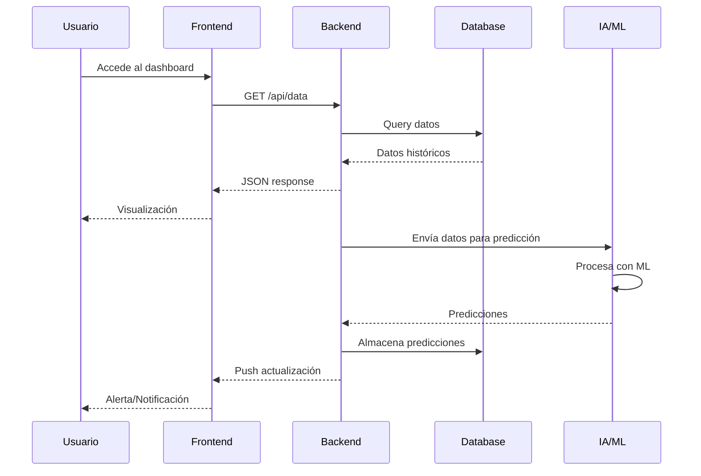
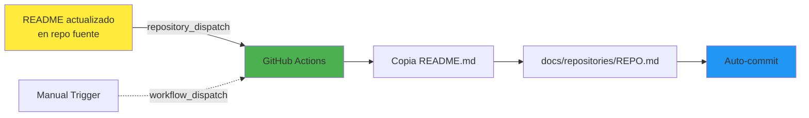

# MybrAIn-Documentation

Documentación centralizada del ecosistema MybrAIn - Sistema SCADA industrial

## 📋 Índice

- [Descripción General](#descripción-general)
- [Arquitectura del Sistema](#arquitectura-del-sistema)
- [Repositorios](#repositorios)
- [Flujo de Datos](#flujo-de-datos)
- [Sincronización Automática](#sincronización-automática)

## 🎯 Descripción General

MybrAIn es un ecosistema completo de monitorización y control SCADA industrial que integra múltiples componentes para la gestión de procesos de refrigeración industrial.

### Componentes Principales

- **PLC_BACKEND**: Backend principal del sistema SCADA
- **PLC_FRONTEND (FRONTEND)**: Interfaz de usuario web
- **IA_FREEZING_SPEED_PREDICTION (Brain_ETL)**: Sistema de predicción con IA
- **MYSQL_QUERIES_INTERFACE (BACKEND_NEXUS)**: Interfaz de consultas MySQL
- **Mybrainsuite**: Suite de herramientas integradas

## 🏗️ Arquitectura del Sistema

```mermaid
graph TB
    subgraph Frontend
        A[PLC_FRONTEND<br/>React UI]
    end
    
    subgraph Backend
        B[PLC_BACKEND<br/>Django API]
        C[BACKEND_NEXUS<br/>MySQL Interface]
    end
    
    subgraph AI_ML
        D[Brain_ETL<br/>IA Prediction]
    end
    
    subgraph Integration
        E[Mybrainsuite<br/>Integration Layer]
    end
    
    subgraph Database
        F[(PostgreSQL)]
        G[(QuestDB)]
        H[(MySQL)]
    end
    
    A -->|HTTP/REST| B
    A -->|HTTP/REST| C
    B --> F
    B --> G
    C --> H
    D --> G
    E --> B
    E --> C
    E --> D
    
    style A fill:#61dafb
    style B fill:#0c4b33
    style C fill:#4479a1
    style D fill:#ff6b6b
    style E fill:#4ecdc4
```

## 📁 Repositorios

### Backend Principal
**[PLC_BACKEND](./docs/repositories/PLC_BACKEND.md)**
- Backend Django del sistema SCADA
- API REST para frontend
- Integración con PostgreSQL y QuestDB
- WebSockets para datos en tiempo real

### Frontend Web
**[PLC_FRONTEND (FRONTEND)](./docs/repositories/FRONTEND.md)**
- Aplicación React
- Dashboards de monitorización
- Visualización de datos en tiempo real
- Interfaz de control del sistema

### Inteligencia Artificial
**[IA_FREEZING_SPEED_PREDICTION (Brain_ETL)](./docs/repositories/Brain_ETL.md)**
- Modelos de predicción con Machine Learning
- ETL para procesamiento de datos
- Predicción de velocidad de congelación
- Optimización de procesos

### Interfaz MySQL
**[MYSQL_QUERIES_INTERFACE (BACKEND_NEXUS)](./docs/repositories/BACKEND_NEXUS.md)**
- Interfaz de consultas MySQL
- API para acceso a datos históricos
- Reportes y analytics

### Suite Integrada
**[Mybrainsuite](./docs/repositories/Mybrainsuite.md)**
- Capa de integración entre componentes
- Herramientas de gestión
- Utilidades compartidas

## 🔄 Flujo de Datos

## 🔄 Sincronización Automática

Este repositorio utiliza GitHub Actions para sincronizar automáticamente la documentación desde los repositorios fuente.

### Funcionamiento

1. **Trigger automático**: Cuando se actualiza el README de cualquier repositorio fuente
2. **Workflow dispatch**: También se puede ejecutar manualmente desde Actions
3. **Sincronización**: Los archivos se copian a `docs/repositories/`
4. **Commit automático**: Los cambios se commitean automáticamente

### Ejecutar Sincronización Manual

1. Ve a la pestaña **Actions**
2. Selecciona **Update README from source repos**
3. Click en **Run workflow**
4. Selecciona el repositorio a sincronizar
5. Click en **Run workflow**

## 🚀 Tecnologías

- **Backend**: Python, Django, FastAPI
- **Frontend**: React, TypeScript
- **Databases**: PostgreSQL, QuestDB, MySQL
- **AI/ML**: Python, Scikit-learn, XGBoost
- **DevOps**: Docker, GitHub Actions
- **Monitoring**: Grafana, Prometheus

## 📊 Estado del Proyecto

## 📝 Licencia

Proyecto privado - Todos los derechos reservados

## 👥 Contacto

Para más información sobre el proyecto MybrAIn, contacta con el equipo de desarrollo.

---

**Última actualización**: Automática via GitHub Actions
